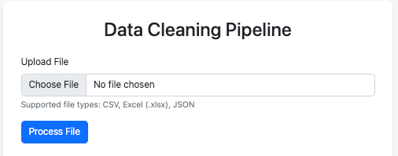
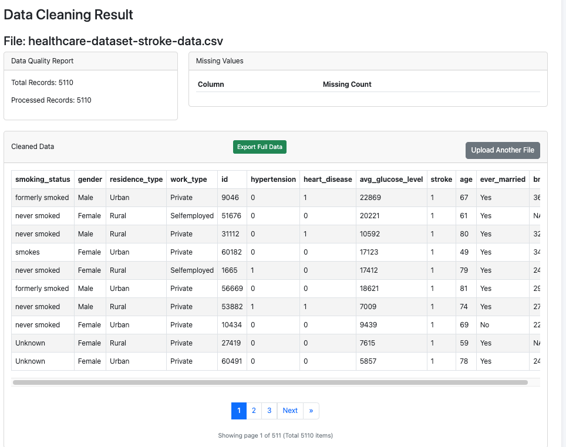

# Data cleaning 
An automated data cleaning pipelines is a robust solution designed to ingest, clean, and transform large datasets in various formats (CSV, Excel, PDF) for downstream analysis or storage. 
The application standardize the import process, validates data, applies a modular cleaning pipeline, and export the cleaned data as an Excel file for further analysis.
The application is built using Spring Boot and thymeleaf for simple user interface. It supports uploading files, viewing cleaned data, and analyzing data quality through intuitive web interface.

### The application has the following features:
* Data ingestion service for supported file formats (CSV, Excel, JSON) and automatically standardize column names and handles empty values uniformly.
* Modular cleaning pipeline: 
    * Remove special characters
    * Normalize whitespace
    * Handle missing values
    * Remove duplicates
    * Data type inference
    * Outlier detection
    * Categorical standardization
* Exports cleaned data to Excel format for download
* Data quality monitoring: Display comprehensive data quality reports to track total records, missing value count, unique value count

### Build and Run the application

* Build project
```
mvn clean install
```
* Run the application
```
mvn spring-boot:run 
```
* The backend will be available at http://localhost:8080.

### Screenshots




